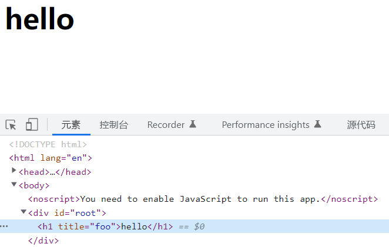
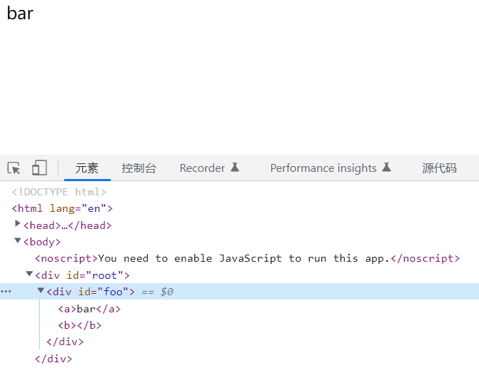
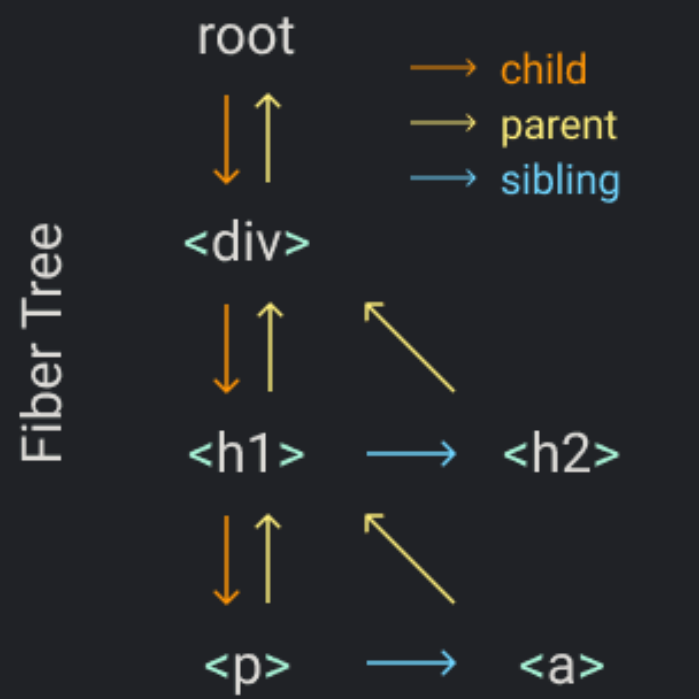

## 简单小🌰

我们将下面这个简单的`React App` 转变为纯`js`实现

```js {1,3}
const element = <h1 title="foo">Hello</h1>
const container = document.getElementById("root")
ReactDOM.render(element, container)
```

`React App` 中，`Bable`将第一行JSX代码编译为`React.createElement`的形式如下

```js
const element = React.createElement(
  "h1",
  { title: "foo" },
  "Hello"
)
```

`createElement` 将返回一个纯`js`对象来描述`element`，即`Virtual Dom`。

```js
const element = {
  type: "h1",
  props: {
    title: "foo",
    children: "Hello",
  },
}
```

我们有了`真实Dom`的描述（`Virtual Dom`），那么我们只需要根据描述创建对应`真实Dom`节点插入到container容器中即可。即我们要完成`ReactDom.render`的任务。

```js
const container = document.getElementById("root")
​
const node = document.createElement(element.type)
node["title"] = element.props.title
​
const text = document.createTextNode("")
text["nodeValue"] = element.props.children
​
node.appendChild(text)
container.appendChild(node)
```

😍✌成功将上述`React App` 转变为纯`js`实现



**通过上述简单🌰已经对React有了简单理解，下面我们将一步步构建一个完整的自己的React。**

## createElement函数

我们从另一个较复杂`React App`小🌰开始！

```js {1-6}
const element = (
  <div id="foo">
    <a>bar</a>
    <b />
  </div>
)
const container = document.getElementById("root")
ReactDOM.render(element, container)
```

`JSX`将转换为

```js
const element = React.createElement(
  "div",
  { id: "foo" },
  React.createElement("a", null, "bar"),
  React.createElement("b")
)
```

我们可以得到`createElement`的雏形。

```js {9}
//  ...children 参数保证了我们的children props 是一个数组。
//  props:{ children: [...] }

function createElement(type, props, ...children) {
  return {
    type,
    props: {
      ...props,
      children,
    },
  }
}
```

但是很明显上述`children`属性的处理完全还不够。因为`children数组`中可能有`element节点`，也有可能是`纯文本`。所以我们将对`纯文本`做一些特别的处理，给它一个特别的`type：TEXT_ELEMENT`为了方便我们自己的React构建。

```js {6-10}
function createElement(type, props, ...children) {
  return {
    type,
    props: {
      ...props,
      children: children.map(child =>
        typeof child === "object"
          ? child
          : createTextElement(child)
      ),
    },
  }
}

function createTextElement(text) {
  return {
    type: "TEXT_ELEMENT",
    props: {
      nodeValue: text,
      children: [],
    },
  }
}
```

我们将🌰中`React.createElement`替换为我们自己的`createElement`,并且给我们自己的`React`库起一个名字`Myact`😂

```js
const Myact = {
  createElement,
}
​
const element = Myact.createElement(
  "div",
  { id: "foo" },
  Myact.createElement("a", null, "bar"),
  Myact.createElement("b")
)
```

我们还需要告诉`Bable`去使用`Myact.createElement`。

```js {1}
/** @jsx Myact.createElement */
//上面这句注释将告诉Bable使用我们自己createElement

const element = (
  <div id="foo">
    <a>bar</a>
    <b />
  </div>
)
const container = document.getElementById("root")
ReactDOM.render(element, container)
```

## render 函数

从上面小🌰中我们可以知道`render`函数的作用是根据`createElement`返回的`虚拟Dom`创建`真实Dom`插入到`container容器`中,也要将虚拟Dom的props放进真实Dom中哦。

我们得到render函数的雏形。

```js
function render(element, container) {
  const dom = document.createElement(element.type)
​
  container.appendChild(dom)
}
​
const Myact = {
  createElement,
  render,
}
```

当然，这样完全不够，因为我还需要将element的children元素同样被createElement。而且需要判断element节点的类型，来创建真实Dom容器。

```js {3-6,8-10}
function render(element, container) {
  //  通过element的type属性判断该创建什么样的真实Dom节点
  const dom =
    element.type == "TEXT_ELEMENT"
      ? document.createTextNode("")
      : document.createElement(element.type)
​  //  遍历递归children为其每一个元素调用createElement创建其真实Dom节点并插入到父容器
  element.props.children.forEach(child =>
    render(child, dom)
  )
​
  container.appendChild(dom)
}
```

最后，只需要完成将虚拟Dom的props放进真实Dom上就可以啦。

```js {8-13}
function render(element, container) {
  const dom =
    element.type == "TEXT_ELEMENT"
      ? document.createTextNode("")
      : document.createElement(element.type)

​  //  因为虚拟Dom props中除了属性还有我们的children，所以需要过滤掉
  const isProperty = key => key !== "children"
  Object.keys(element.props)
    .filter(isProperty)
    .forEach(name => {
      dom[name] = element.props[name]
    })
​
  element.props.children.forEach(child =>
    render(child, dom)
  )
​
  container.appendChild(dom)
}
```

😍👍我们的Myact库构建完成了！

<details>
  <summary style='outline:none'>
    <span
    title='Click Me'
    style='cursor:pointer;margin-bottom:20px;background:#f7a046;display:inline-block;padding:1px 8px;border-radius:5px;color:#fff;font-weight:600'>
    点击查看Myact完整代码
    </span>
  </summary>

```js {1-5}
/** @jsxRuntime classic */
/** 可能在运行Myact时，会出现 错误：pragma and 
    pragmafrag cannot be set when runtime is 
    automatic.我们只需要加上上方注释即可改变
    runtime，让JSX加载我们的Myact代码。 */

function createElement(type, props, ...children) {
  return {
    type,
    props: {
      ...props,
      children: children.map(child =>
        typeof child === "object"
          ? child
          : createTextElement(child)
      ),
    },
  }
}
​
function createTextElement(text) {
  return {
    type: "TEXT_ELEMENT",
    props: {
      nodeValue: text,
      children: [],
    },
  }
}
​
function render(element, container) {
  const dom =
    element.type == "TEXT_ELEMENT"
      ? document.createTextNode("")
      : document.createElement(element.type)
​
  const isProperty = key => key !== "children"
  Object.keys(element.props)
    .filter(isProperty)
    .forEach(name => {
      dom[name] = element.props[name]
    })
​
  element.props.children.forEach(child =>
    render(child, dom)
  )
​
  container.appendChild(dom)
}
​
const Myact = {
  createElement,
  render,
}
​
/** @jsx Myact.createElement */
const element = (
  <div id="foo">
    <a>bar</a>
    <b />
  </div>
)
const container = document.getElementById("root")
Myact.render(element, container)
```
</details>



## Concurrent Mode并发模式

我们构建的Myact库render函数中，使用了递归。这里我们可以知道，我们的render一旦执行就不会停止，直到递归结束。那么如果我们的虚拟Dom树是一个超级大超级深的树，那render可就会执行很长时间啦。这时如果浏览器想要做一些更高优先级的事情，比如用户输入事件或者动画的流畅，显然是不能的，仍要等待我们的render。

```js
element.props.children.forEach(child => render(child, dom))
```

所以，现在我们需要将工作分成小单元，在完成每个小单元后，如果有其他优先级高的事情，我们就中断我们的render，将控制权交给浏览器。

那么我们接下来将递归循环更改为可控的单元执行循环，我们使用[window.requestIdleCallback()](https://developer.mozilla.org/zh-CN/docs/Web/API/Window/requestIdleCallback)来构建我们的循环。**React不再使用requestIdleCallback，而是自己构建了一个scheduler调度器。但是概念是相同的，我们的Myact不再自己构建scheduler调度器。**

> window.requestIdleCallback()方法插入一个函数，这个函数将在浏览器空闲时期被调用。这使开发者能够在主事件循环上执行后台和低优先级工作，而不会影响延迟关键事件，如动画和输入响应。

```js
let nextUnitOfWork = null
​
function workLoop(deadline) {
  let shouldYield = false
  while (nextUnitOfWork && !shouldYield) {
    nextUnitOfWork = performUnitOfWork(
      nextUnitOfWork
    )
    //  是否交出控制权，通过判断还有没有剩余执行时间
    shouldYield = deadline.timeRemaining() < 1
  }
  requestIdleCallback(workLoop)
}
​
requestIdleCallback(workLoop)
​
function performUnitOfWork(nextUnitOfWork) {
  // TODO
  // 此函数要完成的是执行单元任务，并且返回下一个单元任务
}
```

## Fiber 

为了组织我们的工作单元，我们需要一种数据结构：fiber树。每一个元素节点都将有一个fiber对应，而每一个fiber都将是一个工作单元。

小例子🌰
```js
Myact.render(
  <div>
    <h1> <p /><a /> </h1>
    <h2 />
  </div>,
  container
)
```

在渲染中，我们将创建根fiber并将其设置为nextUnitOfWork。其余的工作将发生在performUnitOfWork，在那里我们将为每个fiber做三件事：

* 将元素添加到Dom中
* 为元素的子元素创建fiber（为下一步做准备）
* 选择下一个工作单元



**fiber树的单元任务执行流程：** 当我们完成一个fiber的工作时，它的child将是下一个工作单元，如果没有child那么就会它的sibling将是下一个工作单元。如果也没有sibling将返回父fiber节点，父fiber节点的sibling将会是下一个工作单元。如果父fiber仍没有sibling，将去寻找父fiber的父fiber的sibling。直到返回root fiber，则说明完成了所有的单元任务。

首先，我们将render函数中创建真实Dom的部分封装为一个独立的函数。方便后续使用。

```js {17-19}
function createDom(fiber) {
  const dom =
    fiber.type == "TEXT_ELEMENT"
      ? document.createTextNode("")
      : document.createElement(fiber.type)
​
  const isProperty = key => key !== "children"
  Object.keys(fiber.props)
    .filter(isProperty)
    .forEach(name => {
      dom[name] = fiber.props[name]
    })
​
  return dom
}
​
function render(element, container) {
  // TODO 设置下一个工作单元
}
​
let nextUnitOfWork = null
```

在render函数中，我们设置工作单元为fiber树的root节点

```js
function render(element, container) {
  nextUnitOfWork = {
    dom: container,
    props: {
      children: [element],
    },
  }
}
​
let nextUnitOfWork = null

```

当我们的浏览器有空闲时间时，将会执行我们的workLoop，并且我们将从root执行任务。

```js {14-18}
function workLoop(deadline) {
  let shouldYield = false
  while (nextUnitOfWork && !shouldYield) {
    nextUnitOfWork = performUnitOfWork(
      nextUnitOfWork
    )
    shouldYield = deadline.timeRemaining() < 1
  }
  requestIdleCallback(workLoop)
}
​
requestIdleCallback(workLoop)
​
function performUnitOfWork(fiber) {
  // TODO 将元素添加到Dom节点
  // TODO 为元素得的子元素创建fiber
  // TODO 返回下一个单元任务
}
```

接下来我们来完成performUnitOfWork函数的三件事。👌

第一步我们先将元素添加到Dom节点,我们将Dom存放在fiber的dom属性上。

```js
function performUnitOfWork(fiber) {
  // 将元素添加到Dom节点
  // 判断fiber是否有dom，没有就为其创建dom
  if (!fiber.dom) {
    fiber.dom = createDom(fiber)
  }
​  // 将fiber.dom添加到其父fiber dom树上
  if (fiber.parent) {
    fiber.parent.dom.appendChild(fiber.dom)
  }
​
  // TODO 为元素的子元素创建fiber
  // TODO 返回下一个单元任务
}
```

第二步，我们为元素的每个子元素创建fiber。

```js
function performUnitOfWork(fiber) {
  // 将元素添加到Dom节点
  ...
  // 为元素的子元素创建fiber
  const elements = fiber.props.children
  let index = 0
  let prevSibling = null
​  // 循环为所有孩子元素创建fiber
  while (index < elements.length) {
    const element = elements[index]
​    // fiber初始化
    const newFiber = {
      type: element.type,
      props: element.props,
      parent: fiber,
      dom: null,
    }
    // 判断该元素是否为父fiber的第一个子元素
    // 如果是，该fiber为父fiber的child，否则该fiber为上个fiber的兄弟fiber
    if (index === 0) {
      fiber.child = newFiber
    } else {
      prevSibling.sibling = newFiber
    }
​    // 指针移动
    prevSibling = newFiber
    index++
  }
  // TODO 返回下一个单元任务
```

第三步，我们具体判断下一个工作单元是谁并返回。

```js
function performUnitOfWork(fiber) {
  // 将元素添加到Dom节点
  ...
  // 为元素的子元素创建fiber
  ...
  // 返回下一个单元任务
  // 判断是否有子fiber，如果有这个子fiber就是下一个工作单元
  if (fiber.child) {
    return fiber.child
  }
  //如果没有子fiber，那么该fiber还有兄弟fiber
  let nextFiber = fiber
  while (nextFiber) {
    // 如果有兄弟fiber，该兄弟fiber就是下一个工作单元
    if (nextFiber.sibling) {
      return nextFiber.sibling
    }
    // 如果既该fiber没有子fiber，又没有兄弟fiber，那将返回其父fiber
    nextFiber = nextFiber.parent
  }
}
```

我们的performUnitOfWork函数完成啦！🎉

<details>
  <summary style='outline:none'>
    <span
    title='Click Me'
    style='cursor:pointer;margin-bottom:20px;background:#f7a046;display:inline-block;padding:1px 8px;border-radius:5px;color:#fff;font-weight:600'>
    点击查看该函数完整代码
    </span>
  </summary>

```js
function performUnitOfWork(fiber) {
  //  将元素添加到Dom节点
  if (!fiber.dom) {
    fiber.dom = createDom(fiber)
  }
​
  if (fiber.parent) {
    fiber.parent.dom.appendChild(fiber.dom)
  }
​
  // 为元素的子元素创建fiber
  const elements = fiber.props.children
  let index = 0
  let prevSibling = null
​
  while (index < elements.length) {
    const element = elements[index]
​
    const newFiber = {
      type: element.type,
      props: element.props,
      parent: fiber,
      dom: null,
    }

    if (index === 0) {
      fiber.child = newFiber
    } else {
      prevSibling.sibling = newFiber
    }
​
    prevSibling = newFiber
    index++
  }

  // 返回下一个单元任务
  if (fiber.child) {
    return fiber.child
  }
  let nextFiber = fiber
  while (nextFiber) {
    if (nextFiber.sibling) {
      return nextFiber.sibling
    }
    nextFiber = nextFiber.parent
  }

}
```
</details>

## render commit阶段

我们遇到了一个问题，因为我们已经更改为并发模式，我们每次处理一个元素都会向Dom添加一个新节点。在我们渲染完整棵Dom树前浏览器都可以中断我们的任务去执行优先级更高的任务。所以用户可能将看到一个不完整的UI页面，我们不希望这样。所以我们需要做出调整。

删除performUnitOfWork函数此处代码。

```js {6-8}
function performUnitOfWork(fiber) {
  if (!fiber.dom) {
    fiber.dom = createDom(fiber)
  }
​
  if (fiber.parent) {                         ❌删除
    fiber.parent.dom.appendChild(fiber.dom)   ❌删除
  }                                           ❌删除

  ...
​}
```

用来代替的是我们将跟踪fiber树的root，把它称作工作中的root（work in progress）或wipRoot。每执行一个单元我们并不把真实Dom添加到root真实Dom上，而是只是先把创建好的Dom存放到每个fiber节点上，等到没有下一个任务单元了，我们就知道完成了所有任务，然后才把整个fiber树提交，再去一次性添加到root真实Dom上。

```js {1-3,6,12,16,27-29}
function commitRoot() {
  // TODO add nodes to dom
}

function render(element, container) {
  wipRoot = {
    dom: container,
    props: {
      children: [element],
    },
  }
  nextUnitOfWork = wipRoot
}
​
let nextUnitOfWork = null
let wipRoot = null

function workLoop(deadline) {
  let shouldYield = false
  while (nextUnitOfWork && !shouldYield) {
    nextUnitOfWork = performUnitOfWork(
      nextUnitOfWork
    )
    shouldYield = deadline.timeRemaining() < 1
  }
​  // 等到没有工作单元了，一次性提交
  if (!nextUnitOfWork && wipRoot) {
    commitRoot()
  }
​
  requestIdleCallback(workLoop)
}
```

下面我们来完成commitRoot函数。我们只需要递归遍历fiber树，将每个fiber节点的dom插入到真实dom root上即可。

```js
function commitRoot() {
  commitWork(wipRoot.child) //从root的child开始递归遍历添加dom节点
  wipRoot = null //当commit完成，将正在工作的fiber树根节点置为null
}
​
function commitWork(fiber) {
  if (!fiber) {
    return
  }
  // 添加Dom到其父Dom中
  const domParent = fiber.parent.dom
  domParent.appendChild(fiber.dom)
  // 先递归孩子，再递归兄弟
  commitWork(fiber.child)
  commitWork(fiber.sibling)
}
```

我们已经完成了commit阶段😋。

