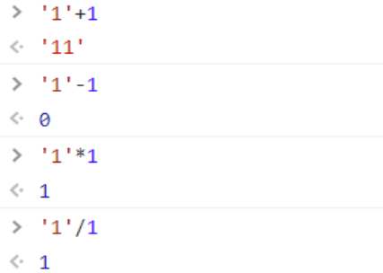

# 数据类型

## 类型

* 基本数据类型：undefined、null、boolean、number、string、symbol、bigInt。
其中 Symbol 和 BigInt 是ES6 中新增的数据类型：

  * Symbol 代表创建后独一无二且不可变的数据类型，
    它主要是为了解决可能出现的全局变量冲突的问题。
    还可以为对象定义私有属性。
  * BigInt 是一种数字类型的数据，它可以表示任意
    精度格式的整数，使用 BigInt 可以安全地存储和
    操作大整数，即使这个数已经超出了 Number 能够
    表示的安全整数范围。
* 引用数据类型：object（array、function都统称为object)

## 存储位置

两种类型的区别在于**存储位置的不同：**

    * 原始数据类型直接存储在栈（stack）中的简单
    数据段，占据空间小、大小固定，属于被频繁使用
    数据，所以放入栈中存储；
    * 引用数据类型存储在堆（heap）中的对象，占
    据空间大、大小不固定。如果存储在栈中，将会
    影响程序运行的性能；引用数据类型在栈中存储
    了指针，该指针指向堆中该实体的起始地址。当
    解释器寻找引用值时，会首先检索其在栈中的地址，
    取得地址后从堆中获得实体。

## 检测方法

  `typeof` 对于基本数据类型来说，除了 `null` 都可以显示正确的类型（null会显示为object），typeof 对于对象来说，除了函数都会显示 object

  `instanceof`通过原型链来判断数据类型的，只能正确判断引用数据类型。

```js {1}
  p1 = new Person()
  p1 instanceof Person // true
```

  Object.prototype.toString.call()可以检测所有的数据类型，算是一个比较完美的方法了。也    有一个弊端：非原生的对象不能检测，比如自定义一个Dog类。

```javascript
  Object.prototype.toString();
  <!--"[object Object]"-->
```

原理：toString是Object的原型方法，而Array、function等**类型作为Object的实例，都重写了toString方法**。不同的对象类型调用toString方法时，根据原型链的知识，调用的是对应的重写之后的toString方法（function类型返回内容为函数体的字符串，Array类型返回元素组成的字符串…），而不会去调用Object上原型toString方法（返回对象的具体类型），所以采用obj.toString()不能得到其对象类型，只能将obj转换为字符串类型；因此，在想要得到对象的具体类型时，应该调用Object原型上的toString方法。

```js
  var obj={}
  var arr=[]
  console.log(Object.prototype.toString.call(obj))    //[object Object]
  console.log(Object.prototype.toString.call(arr))    //[object Array]
```

* typeof原理：
  js 在底层存储变量的时候，会在变量的机器码的低位1-3位存储其类型信息👉

* 000：对象
* 010：浮点数
* 100：字符串
* 110：布尔
* 1：整数
  but, 对于 `undefined` 和 `null` 来说，这两个值的信息存储是有点特殊的。

  `null`：所有机器码均为0

  `undefined`：用 −2^30 整数来表示

  所以，`typeof` 在判断 `null` 的时候就出现问题了，由于 `null` 的所有机器码均为0，因此直接被当做了对象来看待。

* instanceof原理

```javascript
function myInstanceof(left, right) {
  // 获取对象的原型
  let proto = Object.getPrototypeOf(left)
  // 获取构造函数的 prototype 对象
  let prototype = right.prototype; 
 
  // 判断构造函数的 prototype 对象是否在对象的原型链上
  while (true) {
    if (!proto) return false;
    if (proto === prototype) return true;
    // 如果没有找到，就继续从其原型上找，Object.getPrototypeOf方法用来获取指定对象的原型
    proto = Object.getPrototypeOf(proto);
  }
}
```

# 浅拷贝

```js
Object.assign()    //es6的方法
```

Object.assign会合并对象生成一个新对象。如果对象的属性是普通类型改变之后新对象不会改变，如果是引用类型改变后新对象也会改变，所以Object.assign实际上还是浅拷贝。

```js
var obj={aa:1,b:{item:'45'}};
var newObj=Object.assign({},obj);
obj.aa=2;
obj.b.item='kk';
console.log(newObj.aa);        //1
console.log(newObj.b.item);    //kk
```

# 深拷贝

```
JSON.parse(JSON.stringify(obj))
```

利用JSON.stringify(obj)将对象先转为json字符串，再JSON.parse(）转回为json对象可以实现深拷贝，这也是比较常用的一种方法。

弊端：<https://juejin.cn/post/6844904130247573517>

 1、如果obj里面存在时间对象,JSON.parse(JSON.stringify(obj))之后，时间对象变成了字符串。

 2、如果obj里有RegExp、Error对象，则序列化的结果将只得到空对象。

 3、如果obj里有函数，undefined，则序列化的结果会把函数， undefined丢失。

 4、如果obj里有NaN、Infinity和-Infinity，则序列化的结果会变成null。

 5、JSON.stringify()只能序列化对象的可枚举的自有属性。如果obj中的对象是有构造函数生成的， 则使    用JSON.parse(JSON.stringify(obj))深拷贝后，会丢弃对象的constructor。

 6、如果对象中存在循环引用的情况也无法正确实现深拷贝。

**用js实现一个深拷贝**

其实深拷贝可以拆分成 2 步，浅拷贝 + 递归，浅拷贝时判断属性值是否是对象，如果是对象就进行递归操作，两个一结合就实现了深拷贝。

```js
  function cloneDeep(source) {
      if (!isObject(source)) return source; // 非对象返回自身
      var target = Array.isArray(source) ? [] : {};
      for (var key in source) {
        if (source.hasOwnProperty(i)) {
          if (isObject(source[key])) {
            target[key] = cloneDeep(source[key]); // 注意这里 递归
          } else {
            target[key] = source[key];
          }
        }
      }
      return target;
    }
    function isObject(obj) {
      return typeof obj === 'object' && obj != null;
    }
```

# 作用域

## 变量声明提升

* 在 JavaScript 中，函数声明（function aa(){}）与变量声明（var）经常被 JavaScript 引擎隐式地提升到当前作用域的顶部。
* 函数声明的优先级高于变量，如果变量名跟函数名相同且未赋值，则函数声明会覆盖变量声明
* 声明语句中的赋值部分并不会被提升，只有变量的名称被提升

## 作用域链

js中主要有**全局执行上下文和函数执行上下文**，eval执行上下文不做讨论。

每个执行上下文都有一个关联的**变量对象**，而这个上下文上定义的所有变量和函数都会存在于这个对象上。

每个函数都有自己上下文，当执行流到函数时，会将函数上下文压入上下文栈中（最开始栈中只有全局上下文（浏览器为window）），函数执行完毕会弹出该函数上下文，将控制权返还给之前的上下文。

上下文代码在执行时，会创建变量对象的作用域链，这个作用域链决定着各级上下文访问变量和函数的顺序。正在执行的上下文的变量对象始终位于作用域链的最前端。（**个人理解：作用域链其实就是保存了一串有顺序的变量对象）**如果上下文是函数，则其**活动对象**作为变量对象。（活动对象最初只有一个定义变量：arguments（全局上下文没有这个arguments））。作用域链的下一个变量对象来自包含上下文，再下一个变量对象来自再下一个包含上下文。以此类推直至全局上下文，全局上下文始终在作用域链末端。

代码执行的标识符解析是通过沿作用域链逐级搜索标识符完成的，从前到后直至找到（如果找不到通常报错）

## 闭包

[https://juejin.cn/post/7085560639317344269](https://juejin.cn/post/7085560639317344269)

闭包的原理就是作用域链，比函数F内部有一个函数G，函数 G可以访问到函数F中的变量，那么函数G就是闭包。

```js
   function F() {
      let a = 1
      window.G = function () {
        console.log(a)
      }
    }
    F()
    G() // 1
```

闭包其实就是，一个函数上下文使用着它的包含函数上下文的变量，导致它的包含上下文不能销毁。

缺点：占内存，内存泄漏。

优点：闭包的第一个作用是使我们在函数外部能够访问到函数内部的变量。通过使用闭包，可以通过在外部调用闭包函数，从而在外部访问到函数内部的变量，可以使用这种方法来创建私有变量。

```js
function a() {
            var c = 1;
            function b() {
                c = 2;
            }
            b();
            console.log(c); //2
        }
        a();
```

​           闭包的另一个作用是使已经运行结束的函数上下文中的变量对象继续留在内存中，因为闭包函数保留了这个变量对象的引用，所以这个变量对象不会被回收。

# 原型和继承

## 原型和原型链

[https://juejin.cn/post/6934498361475072014](https://juejin.cn/post/6934498361475072014)

## Object.create()、new Object()和{}的区别

><https://juejin.cn/post/6844903917835436045>

* 字面量和`new`关键字创建的对象是`Object`的实例，原型指向`Object.prototype`，继承内置对象`Object`
* new操作符new一个构造函数时比{}字面量多了 将构造函数this指向
* `Object.create(arg, pro)`创建的对象的原型取决于`arg`，`arg`为`null`，新对象是空对象，没有原型，不继承任何对象；`arg`为指定对象，新对象的原型指向指定对象，继承指定对象

## new操作符的实现

><https://juejin.cn/post/6844903789070123021>

* **`new`****操作构造函数会将创建出来的实例可以访问到构造函数中的属性**
* **`new`****操作构造函数创建出来的实例可以访问到构造函数原型链中的属性，也就是说通过****`new`****操作符，实例与构造函数通过原型链连接了起来**
* **构造函数中一般没有return，如果有且返回的是基本类型，则和无return效果一样，如果返回引用数据类型则构造函数创建出的实例为这个引用对象**

```js
//参数分别为构造函数和构造函数的实参
function create(Con, ...args) {
    
  let obj = Object.create(Con.prototype)
  let result = Con.apply(obj, args)
  return result instanceof Object ? result : obj  
}
```

在[JS的指向问题](https://link.juejin.cn?target=https%3A%2F%2Flijing0906.github.io%2Fpost%2FJSthis)中讲**new绑定**时讲了`new`操作符其实做了以下四步：

```
var obj = new Object(); // 创建一个空对象
obj.__proto__ = F.prototype; // obj的__proto__指向构造函数的prototype
var result = F.call(obj); // 把构造函数的this指向obj，并执行构造函数把结果赋值给result
if (typeof(result) === 'object') {
    objB = result; // 构造函数F的执行结果是引用类型，就把这个引用类型的对象返回给objB
} else {
    objB = obj; // 构造函数F的执行结果是值类型，就返回obj这个空对象给objB
}
```

## 继承

八种继承:<https://juejin.cn/post/6844903696111763470>

<https://juejin.cn/post/6886379203843850247>

构造函数绑定：使用 call 或 apply 方法，将父对象的构造函数绑定在子对象上

```js
function Cat(name,color){
 　Animal.apply(this, arguments);
 　this.name = name;
 　this.color = color;
}
```

实例继承：将子对象的 prototype 指向父对象的一个实例

```js
Cat.prototype = new Animal();
Cat.prototype.constructor = Cat;
```

拷贝继承：如果把父对象的所有属性和方法，拷贝进子对象

```js
function extend(Child, Parent) {
　　　var p = Parent.prototype;
　　　var c = Child.prototype;
　　　for (var i in p) {
　　　   c[i] = p[i];
　　　}
　　　c.uber = p;
}
```

原型继承：将子对象的 prototype 指向父对象的 prototype

```js
function extend(Child, Parent) {
    var F = function(){};
    　F.prototype = Parent.prototype;
    　Child.prototype = new F();
    　Child.prototype.constructor = Child;
    　Child.uber = Parent.prototype;
}
```

ES6 语法糖 extends继承

```js
class ColorPoint extends Point {
    constructor(x, y, color) {
        super(x, y); // 调用父类的constructor(x, y)
        this.color = color;
    }
    toString() {
        return this.color + ' ' + super.toString(); // 调用父类的toString()
    }
}
```

# call,apply,bind

<https://github.com/qianguyihao/Web/blob/master/04-JavaScript%E5%9F%BA%E7%A1%80/22-call%E3%80%81apply%20%E5%92%8C%20bind.md>

```js
fn1.call(想要将this指向哪里, 函数实参1, 函数实参2);
```

```
fn1.apply(想要将this指向哪里, [函数实参1, 函数实参2]);
```

```
新函数 = fn1.bind(想要将this指向哪里, 函数实参1, 函数实参2);
```

# EventLoop 事件循环

><https://juejin.cn/post/6844903638238756878>
><https://juejin.cn/post/6844903657264136200>

```
Promise.resolve().then(()=>{
  console.log('Promise1')  
  setTimeout(()=>{
    console.log('setTimeout2')
  },0)
})

setTimeout(()=>{
  console.log('setTimeout1')
  Promise.resolve().then(()=>{
    console.log('Promise2')    
  })
},0)
复制代码
```

#### 这回是嵌套，大家可以看看，最后输出结果是Promise1，setTimeout1，Promise2，setTimeout2

### 宏任务

| **#**                 | **浏览器** | **Node** |
| :-------------------- | :--------- | :------- |
| I/O                   | ✅          | ✅        |
| setTimeout            | ✅          | ✅        |
| setInterval           | ✅          | ✅        |
| setImmediate          | ❌          | ✅        |
| requestAnimationFrame | ✅          | ❌        |

*有些地方会列出来**`UI Rendering`**，说这个也是宏任务，可是在读了*[HTML规范文档](https://link.juejin.cn?target=https%3A%2F%2Fhtml.spec.whatwg.org%2Fmultipage%2Fwebappapis.html%23event-loop-processing-model)*以后，发现这很显然是和微任务平行的一个操作步骤*

 *`requestAnimationFrame`**姑且也算是宏任务吧，**`requestAnimationFrame`**在*[MDN的定义](https://link.juejin.cn?target=https%3A%2F%2Fdeveloper.mozilla.org%2Fzh-CN%2Fdocs%2FWeb%2FAPI%2FWindow%2FrequestAnimationFrame)*为，下次页面重绘前所执行的操作，而重绘也是作为宏任务的一个步骤来存在的，且该步骤晚于微任务的执行*

### 微任务

| **#**                      | **浏览器** | **Node** |
| :------------------------- | :--------- | :------- |
| process.nextTick           | ❌          | ✅        |
| MutationObserver           | ✅          | ❌        |
| Promise.then catch finally | ✅          | ✅        |

# setTimeout，setInterval

## setInterval的实现

<https://juejin.cn/post/6844903839934447629>

**简单版本**

首先我们先用 `setTimeout` 实现一个简单版本的 `setInterval`。

`setInterval` 需要不停循环调用，这让我们想到了递归调用自身：

```javascript
const mySetInterval = (cb, time) => {
  const fn = () => {
    cb() // 执行传入的回调函数
    setTimeout(() => {
      fn() // 递归调用自己
    }, time)
  }
  setTimeout(fn, time)
}
```

# ==和===，object.is()区别

## 什么是==

==是一个比较运算符，在比较前会转换成相同类型。

所以，在数字和字符串相比较时，JS会将字符串先转换为数字，空字符串转换为0，没有数值的字符串会被转换为NaN，然后再进行比较。

## 什么是===

 ===是JS中的严格比较运算符，对于类型不相等时返回false。类型相等时再去比较值是否相等。

## Object.is()

```plain
Object.is(value1, value2);
```

使用 Object.is 来进行相等判断时，一般情况下和三等号的判断相同，它处理了一些特殊的情况，比如 -0 和 +0 不再相等，两个 NaN 是相等的。

# js中0为false，非0为ture

# JS循环大总结， for, forEach，for in，for of, map区别

>[https://juejin.cn/post/6983313955233988644](https://juejin.cn/post/6983313955233988644)

* forEach 遍历列表值,不能使用 break 语句或使用 return 语句
* for in 遍历对象键值(key),或者数组下标,不推荐循环一个数组
* for of 遍历列表值,允许遍历 Arrays（数组）, Strings（字符串）, Maps（映射）, Sets（集合）等可迭代的数据结构等.在 ES6 中引入的 for of 循环，以替代 for in 和 forEach() ，并支持新的迭代协议。
* for in循环出的是key，for of循环出的是value；
* for of是ES6新引入的特性。修复了ES5的for in的不足；
* for of不能循环普通的对象，需要通过和Object.keys()搭配使用。

# 箭头函数和普通函数

>[https://juejin.cn/post/6844903801799835655](https://juejin.cn/post/6844903801799835655)

# Promise

**结合**`Promise A+`**规范，我们可以总结出**`Promise`**所具有的特征：**

* `Promise`只有三种状态：`pending`、`fulfilled`、`rejected`；[规范2.1]\color{blue} {[规范 2.1]} [规范2.1]
* `new Promise`的时候，需要传入一个执行器`executor`，`executor`会立即执行；
* `executor`接收两个参数，分别是`resolve`、`reject`；
* 默认状态是`pending`，`pending`状态可以转为`fulfilled`状态或者`rejected`状态，状态一旦变更，就不可改变；[规范2.1.1]\color{blue}{[规范 2.1.1]} [规范2.1.1]
* `fulfilled`状态必须有一个`value`来保存成功的结果；[规范2.1.2]\color{blue}{[规范 2.1.2]} [规范2.1.2]
* `rejected`状态必须有一个`reason`来保存失败的结果；[规范2.1.3]\color{blue}{[规范 2.1.3]} [规范2.1.3]
* `Promise`必须要有一个`then`方法，`then`方法接收两个参数，分别是成功后的回调`onFulfilled`、失败后的回调`onRejected`；[规范2.2]\color{blue}{[规范 2.2]} [规范2.2]
* `Promise`成功后，将执行`then`方法的成功回调`onFulfilled`，并且`value`将作为成功后回调的参数；
* `Promise`失败后，将执行`then`方法的失败回调`onRejected`，并且`reason`将作为失败后回调的参数；

# 节流防抖

```js
/**
*
* @param fn 事件触发的回调函数
* @param delay 延迟时间
*/
function debounce(fn, delay = 500) {
let timer = null;
 
return function () {
if (timer) {
clearTimeout(timer);
}
timer = setTimeout(() => {
// 执行事件的回调函数
fn.apply(this, arguments);
// 执行后清空定时器
timer = null
}, delay)
}
}
 
// 调用
let elem = document.getElementById('input');
elem.addEventListener('change', debounce(function () {
console.log('change');
}, 1000))

```

```js
/**
* 
* @param fn 事件触发的回调函数
* @param delay 延迟时间
*/
function throttle(fn, delay = 100) {
let timer = null;
return function () {
if (timer) {
return
}
timer = setTimeout(() => {
// 执行事件的回调函数
fn.apply(this, arguments);
// 执行后清空定时器
timer = null
}, delay)
}
}
// 调用
let dom = document.getElementById('div');
dom.addEventListener('drag', throttle(function () {
console.log('drag');
}, 300));

```

# 字符串数字转化

