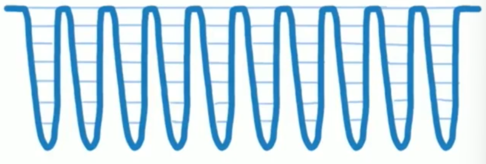
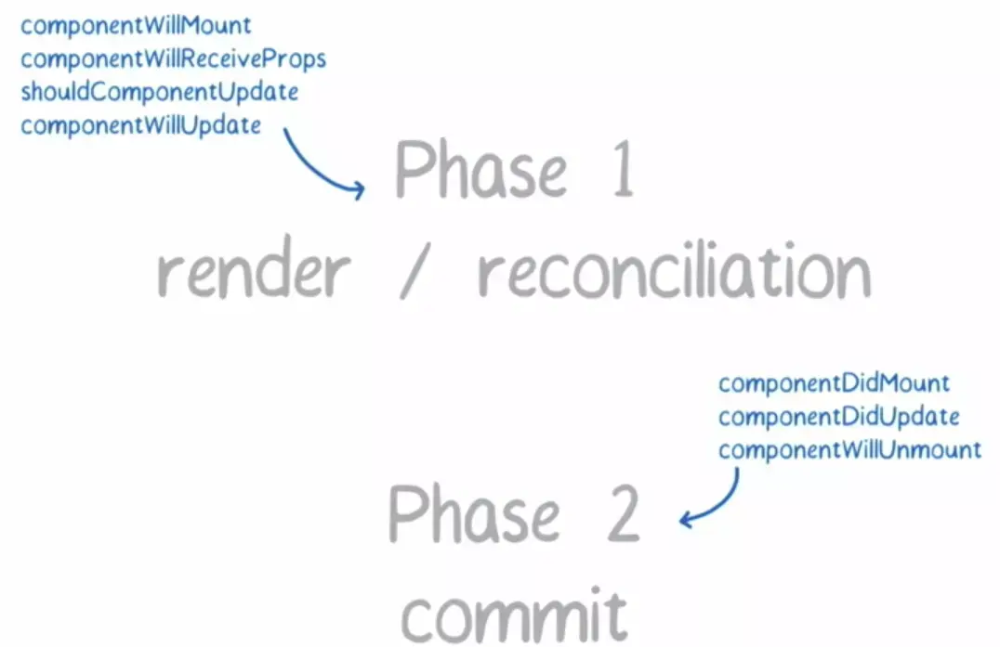
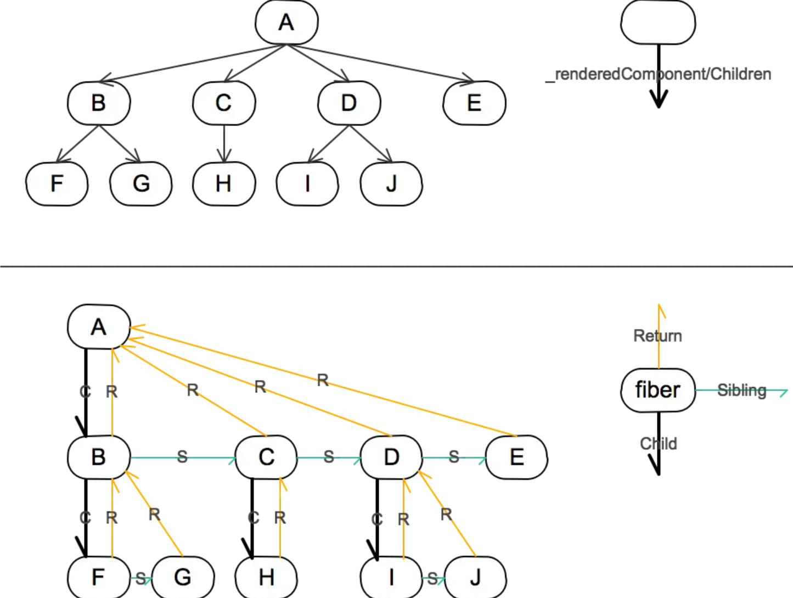
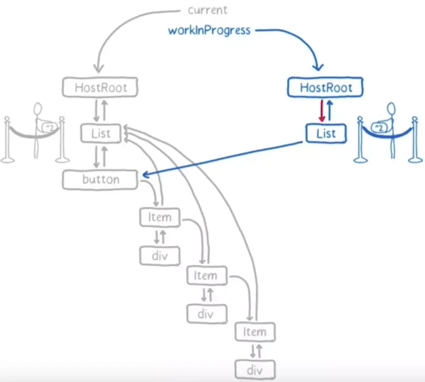

## setState是同步还是异步的

### 举个🌰

```jsx
class App extends React.Component {
  state = { val: 0 }

  componentDidMount() {
    this.setState({ val: this.state.val + 1 })
    console.log(this.state.val)

    this.setState({ val: this.state.val + 1 })
    console.log(this.state.val)

    setTimeout(_ => {
      this.setState({ val: this.state.val + 1 })
      console.log(this.state.val);

      this.setState({ val: this.state.val + 1 })
      console.log(this.state.val)
    }, 0)
  }

  render() {
    return <div>{this.state.val}</div>
  }
}
```

**结果：**钩子函数中的 `setState` 无法立马拿到更新后的值，所以前两次都是输出0，当执行到 `setTimeout` 里的时候，前面两个state的值已经被更新，由于 `setState` 批量更新的策略， `this.state.val` 只对最后一次的生效，为1，而在 `setTimeout` 中 `setState` 是可以同步拿到更新结果，所以 `setTimeout` 中的两次输出2，3，最终结果就为 `0, 0, 2, 3 `。

### 总结

> 合成事件：即`react`为了解决跨平台，兼容性问题，自己封装了一套事件机制，代理了原生的事件，像在`jsx`中常见的`onClick`、`onChange`这些都是合成事件。

* `setState` 只在合成事件和钩子函数中是“异步”的，在原生事件和 `setTimeout` 中都是同步的。
* `setState`的“异步”并不是说内部由异步代码实现，其实本身执行的过程和代码都是同步的，只是合成事件和钩子函数的调用顺序在更新之前，导致在合成事件和钩子函数中没法立马拿到更新后的值，形式了所谓的“异步”，当然可以通过第二个参数 `setState(partialState, callback)` 中的`callback`拿到更新后的结果。
* `setState` 的批量更新优化也是建立在“异步”（合成事件、钩子函数）之上的，在原生事件和`setTimeout` 中不会批量更新，在“异步”中如果对同一个值进行多次 `setState` ， `setState` 的批量更新策略会对其进行覆盖，取最后一次的执行，如果是同时 `setState` 多个不同的值，在更新时会对其进行合并批量更新。

**个人简单的认为，只要原生的js范围内`setState`都表现为‘同步’，`react`的范围内都表现为‘异步’。（后续可能会更深入去分析setState）**

## Fiber

### 什么是Fiber

其实是一种数据结构：

```js
const fiber = {
    stateNode,    // 节点实例
    child,        // 子节点
    sibling,      // 兄弟节点
    return,       // 父节点
}
```

### 为什么引入Fiber

React可以分为3层：

* `Virtual DOM` 层，描述页面长什么样。
* `Reconciler` 层，负责调用组件生命周期方法，进行 `Diff` 运算等。
* `Renderer` 层，根据不同的平台，渲染出相应的页面，比较常见的是 `ReactDOM` 和 `ReactNative`。

`Fiber`引入后，`Reconciler`有了新名字`Fiber Reconciler`。

以前的`Stack Reconciler`运行过程不可打断。


而`Fiber Reconciler` 每执行有单时间，都可以将控制权交回浏览器，可以分段执行。



**为了达到可中断的效果，就需要一个调度器`Scheduler`来进行任务分配。优先级有以下几种：**

* synchronous，与之前的Stack Reconciler操作一样，同步执行
* task，在next tick之前执行
* animation，下一帧之前执行
* high，在不久的将来立即执行
* low，稍微延迟执行也没关系
* offscreen，下一次render时或scroll时才执行

> 优先级高的任务（如键盘输入）可以打断优先级低的任务（如Diff）的执行，从而更快的生效。

`Fiber Reconciler`在执行中分为两个阶段：



* 阶段一，生成 Fiber 树，得出需要更新的节点信息。这一步是一个渐进的过程，可以被打断。
* 阶段二，将需要更新的节点一次过批量更新，这个过程不能被打断。

### Fiber树

Fiber Reconciler 在阶段一进行 Diff 计算的时候，会生成一棵 Fiber 树。这棵树是在 Virtual DOM 树的基础上增加额外的信息来生成的，它本质来说是一个链表。



Fiber 树在首次渲染的时候会一次过生成。在后续需要 Diff 的时候，会根据已有树和最新 Virtual DOM 的信息，生成一棵新的树。这颗新树每生成一个新的节点，都会将控制权交回给主线程，去检查有没有优先级更高的任务需要执行。如果没有，则继续构建树的过程：



如果过程中有优先级更高的任务需要进行，则 Fiber Reconciler 会丢弃正在生成的树，在空闲的时候再重新执行一遍。

在构造 Fiber 树的过程中，Fiber Reconciler 会将需要更新的节点信息保存在Effect List当中，在阶段二执行的时候，会批量更新相应的节点。
