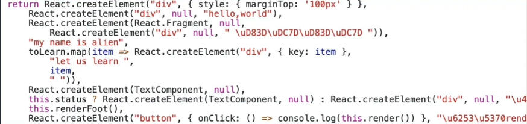
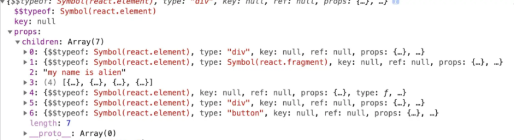
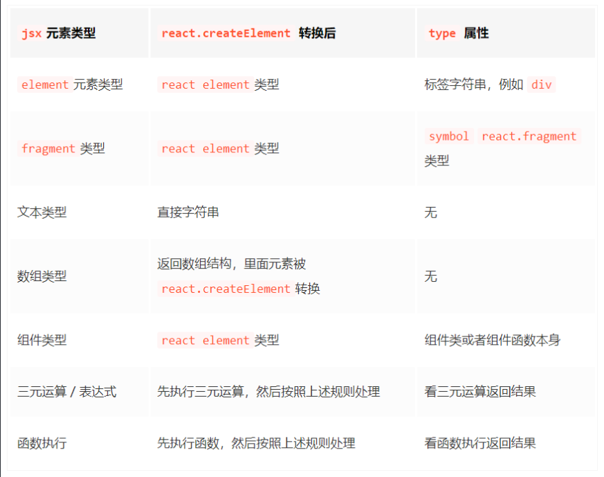

---

title: React Study--基础

date: "2022-07-25T18:00:32.169Z"

description: 我的React学习过程，一些笔记...

tags: ['React']

disqus: true

relative: false

---

## 学习JSX

### 小疑惑

在我刚学习react时，有一个疑惑：为什么创建一个react组件时，默认有一句

>import React from 'react'
呢，并且我代码中并没有使用但是React确是高亮的，甚至把这句代码删除仍然可以正常运行。

原来， jsx 在被 babel 编译后，会被编译成 React.createElement 形式，所以需要引入 React，防止找不到 React 引起报错。至于新版为什么没有报错，详细可参考官方：

>[https://react.docschina.org/blog/2020/09/22/introducing-the-new-jsx-transform.html](https://react.docschina.org/blog/2020/09/22/introducing-the-new-jsx-transform.html)

### 认识JSX

步入正题！

JSX即createElement的语法糖，为了方便书写。

#### createElement语法

```javascript
React.createElement(
  type,
  [props],
  [...children]
```

#### 通过一个案例去了解JSX

```javascript
const toLearn = [ 'react' , 'vue' , 'webpack' , 'nodejs'  ]
const TextComponent = ()=> <div> hello , i am function component </div> 
class Index extends React.Component{
    status = false /* 状态 */
    renderFoot=()=> <div> i am foot</div>
    render(){
        /* 以下都是常用的jsx元素节 */
        return <div style={{ marginTop:'100px' }}   >
            { /* element 元素类型 */ }
            <div>hello,world</div>
            { /* fragment 类型 */ }
            <React.Fragment>
                <div> 👽👽 </div>
            </React.Fragment>
            { /* text 文本类型 */ }
            my name is alien 
            { /* 数组节点类型 */ }
            { toLearn.map(item=> <div key={item} >let us learn { item } </div> ) }
            { /* 组件类型 */ }
            <TextComponent/>
            { /* 三元运算 */  }
            { this.status ? <TextComponent /> : <div>三元运算</div> }
            { /* 函数执行 */ } 
            { this.renderFoot() }
            <button onClick={ ()=> console.log( this.render() ) } >打印render后的内容</button>
        </div>
    }
}
```

将会被编译为：

createElement处理后（8个元素，图中少展示了一个）：


#### JSX的转换规则


ps：

* 对于上述在 jsx 中写的 map 数组结构的子节点，外层会被加上 fragment
* map 返回数组结构，作为 fragment 的子节点。

#### React底层调和后，将变为什么？

在调和阶段，上述 React element 对象的每一个子节点都会形成一个与之对应的 fiber 对象，然后通过 sibling、return、child 将每一个 fiber 对象联系起来。

不同种类的fiber Tag

```javascript
export const FunctionComponent = 0;       // 函数组件
export const ClassComponent = 1;          // 类组件
export const IndeterminateComponent = 2;  // 初始化的时候不知道是函数组件还是类组件 
export const HostRoot = 3;                // Root Fiber 可以理解为根元素 ， 通过reactDom.render()产生的根元素
export const HostPortal = 4;              // 对应  ReactDOM.createPortal 产生的 Portal 
export const HostComponent = 5;           // dom 元素 比如 <div>
export const HostText = 6;                // 文本节点
export const Fragment = 7;                // 对应 <React.Fragment> 
export const Mode = 8;                    // 对应 <React.StrictMode>   
export const ContextConsumer = 9;         // 对应 <Context.Consumer>
export const ContextProvider = 10;        // 对应 <Context.Provider>
export const ForwardRef = 11;             // 对应 React.ForwardRef
export const Profiler = 12;               // 对应 <Profiler/ >
export const SuspenseComponent = 13;      // 对应 <Suspense>
export const MemoComponent = 14;          // 对应 React.memo 返回的组件
```

fiber 结构

* child： 一个由父级 fiber 指向子级 fiber 的指针。
* return：一个子级 fiber 指向父级 fiber 的指针。
* sibling: 一个 fiber 指向下一个兄弟 fiber 的指针。

#### 可控性render

问题：

1.案例返回的 children 虽然是一个数组，但是数组里面的数据类型却是不确定的，有对象类型( 如ReactElement ) ，有数组类型(如 map 遍历返回的子节点)，还有字符串类型(如文本)；

2.无法对 render 后的 React element 元素进行可控性操作。

解决：

1.将上述children扁平化处理，将数组类型的子节点打开 ；

2.去除掉children中文本类型节点；

3.向children最后插入say goodbye元素；

4.克隆新的元素节点并渲染。

改造例子：

```javascript
class Index extends React.Component{
    status = false /* 状态 */
    renderFoot=()=> <div> i am foot</div>
    /* 控制渲染 */
    controlRender=()=>{
        const reactElement = (
            <div style={{ marginTop:'100px' }} className="container"  >   
                 { /* element 元素类型 */ }
                <div>hello,world</div>  
                { /* fragment 类型 */ }
                <React.Fragment>      
                    <div> 👽👽 </div>
                </React.Fragment>
                { /* text 文本类型 */ }
                my name is alien       
                { /* 数组节点类型 */ }
                { toLearn.map(item=> <div key={item} >let us learn { item } </div> ) } 
                { /* 组件类型 */ }
                <TextComponent/>  
                { /* 三元运算 */  }
                { this.status ? <TextComponent /> :  <div>三元运算</div> }  
                { /* 函数执行 */ } 
                { this.renderFoot() }  
                <button onClick={ ()=> console.log( this.render() ) } >打印render后的内容</button>
            </div>
        )
        console.log(reactElement)
        const { children } = reactElement.props
        /* 第1步 ： 扁平化 children  */
        const flatChildren = React.Children.toArray(children)
        console.log(flatChildren)
        /* 第2步 ： 除去文本节点 */
        const newChildren :any= []
        React.Children.forEach(flatChildren,(item)=>{
            if(React.isValidElement(item)) newChildren.push(item)
        })
        /* 第3步，插入新的节点 */
        const lastChildren = React.createElement(`div`,{ className :'last' } ,`say goodbye`)
        newChildren.push(lastChildren)
        
        /* 第4步：修改容器节点 */
        const newReactElement =  React.cloneElement(reactElement,{} ,...newChildren )
        return newReactElement
    }
    render(){
        return this.controlRender()
    }
}
```

第一步：扁平化，规范children数组

```javascript
const flatChildren = React.Children.toArray(children)
```

第二步：验证react element节点，去除文本节点

```javascript
const newChildren :any= []
React.Children.forEach(flatChildren,(item)=>{
    if(React.isValidElement(item)) newChildren.push(item)
})
```

ps：React.Children.forEach = React.Children.toArray + Array.prototype.forEach
第三步：用createElemnet插入到children最后

```javascript
 /* 第三步，插入新的节点 */
const lastChildren = React.createElement(`div`,{ className :'last' } ,`say goodbye`)
newChildren.push(lastChildren)
```

第四步：创建新的容器元素

```javascript
/* 第 4 步：修改容器节点 */
const newReactElement =  React.cloneElement(reactElement,{} ,...newChildren )
```

### bable解析JSX大致流程

两个插件：

* @babel/plugin-syntax-jsx ： 使用这个插件，能够让 Babel 有效的解析 JSX 语法。
* @babel/plugin-transform-react-jsx ：这个插件内部调用了 @babel/plugin-syntax-jsx，可以把 React JSX 转化成 JS 能够识别的 createElement 格式。

## React组件

### 类组件

在 class 组件中，除了继承 React.Component ，底层还加入了 updater 对象，组件中调用的 setState 和 forceUpdate 本质上是调用了 updater 对象上的 enqueueSetState 和 enqueueForceUpdate 方法。

>react/src/ReactBaseClasses.js

```javascript
function Component(props, context, updater) {
  this.props = props;      //绑定props
  this.context = context;  //绑定context
  this.refs = emptyObject; //绑定ref
  this.updater = updater || ReactNoopUpdateQueue; //上面所属的updater 对象
}
/* 绑定setState 方法 */
Component.prototype.setState = function(partialState, callback) {
  this.updater.enqueueSetState(this, partialState, callback, 'setState');
}
/* 绑定forceupdate 方法 */
Component.prototype.forceUpdate = function(callback) {
  this.updater.enqueueForceUpdate(this, callback, 'forceUpdate');
}
```

ps:如果没有在 constructor 的 super 函数中传递 props，那么接下来 constructor 执行上下文中就获取不到 props ，这是为什么呢？刚才的 Component 源码已经说得明明白白了，绑定 props 是在父类 Component 构造函数中，执行 super 等于执行 Component 函数，此时 props 没有作为第一个参数传给 super() ，在 Component 中就会找不到 props 参数，从而变成 undefined ，在接下来 constructor 代码中打印 props 为 undefined 。

### 函数组件

对于类组件来说，底层只需要实例化一次，实例中保存了组件的 state 等状态。对于每一次更新只需要调用 render 方法以及对应的生命周期就可以了。但是在函数组件中，每一次更新都是一次新的函数执行，一次函数组件的更新，里面的变量会重新声明。

### React对组件的处理

在 React 调和渲染 fiber 节点的时候，如果发现 fiber tag 是 ClassComponent = 1，则按照类组件逻辑处理，如果是 FunctionComponent = 0 则按照函数组件逻辑处理。当然 React 也提供了一些内置的组件，比如说 Suspense 、Profiler 等。

>对于类组件的执行，是在react-reconciler/src/ReactFiberClassComponent.js中

```javascript
function constructClassInstance(
    workInProgress, // 当前正在工作的 fiber 对象
    ctor,           // 我们的类组件
    props           // props 
){
     /* 实例化组件，得到组件实例 instance */
     const instance = new ctor(props, context)
}
```

>对于函数组件的执行，是在react-reconciler/src/ReactFiberHooks.js中

```javascript
function renderWithHooks(
  current,          // 当前函数组件对应的 `fiber`， 初始化
  workInProgress,   // 当前正在工作的 fiber 对象
  Component,        // 我们函数组件
  props,            // 函数组件第一个参数 props
  secondArg,        // 函数组件其他参数
  nextRenderExpirationTime, //下次渲染过期时间
){
     /* 执行我们的函数组件，得到 return 返回的 React.element对象 */
     let children = Component(props, secondArg);
}
```

### 组件通信

* props 和 callback 方式
* ref 方式
* React-redux 或 React-mobx 状态管理方式
* context 上下文方式
* event bus 事件总线
