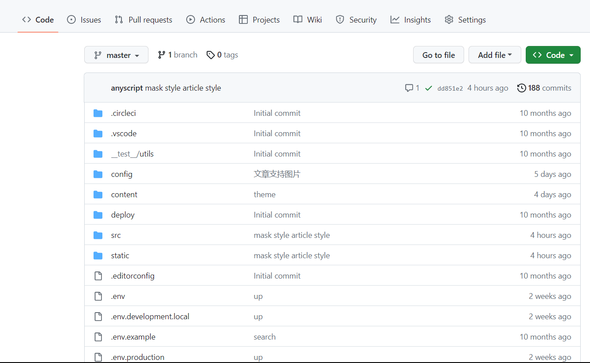
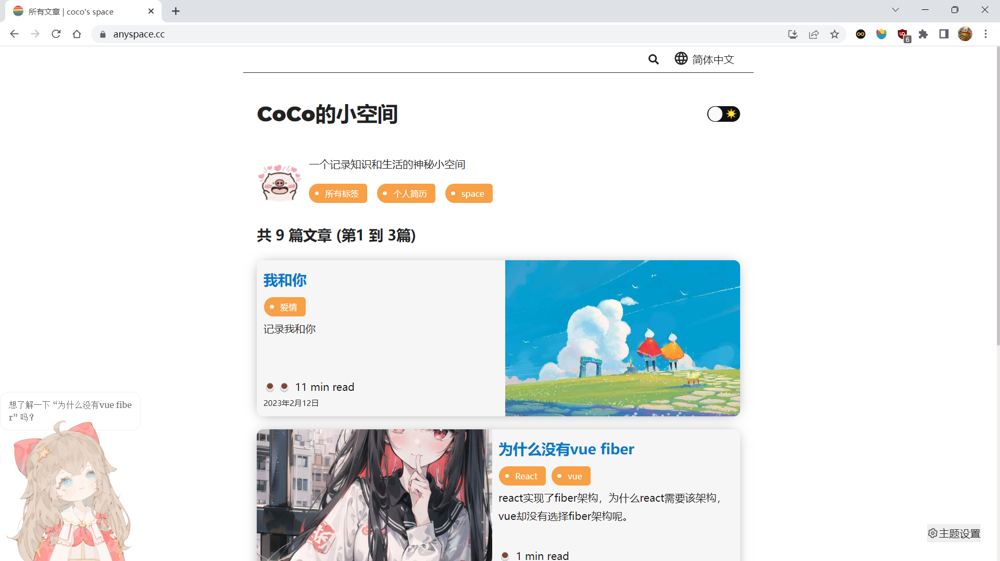
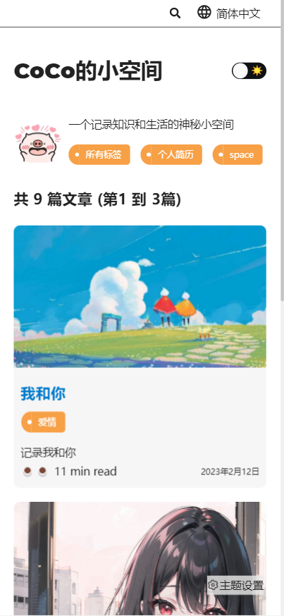
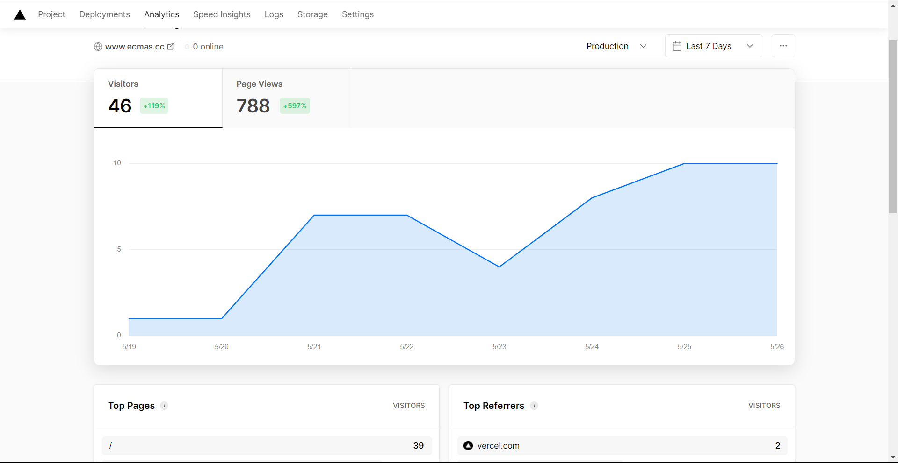
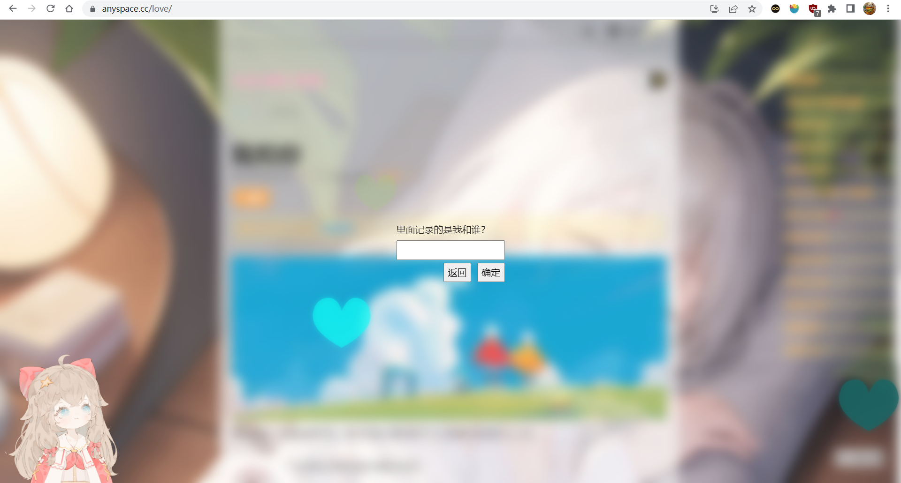
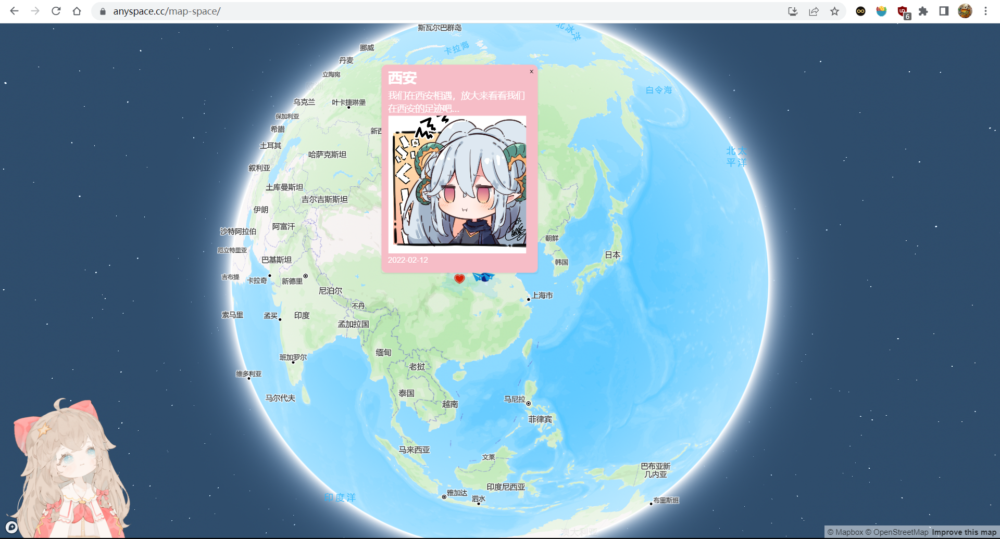
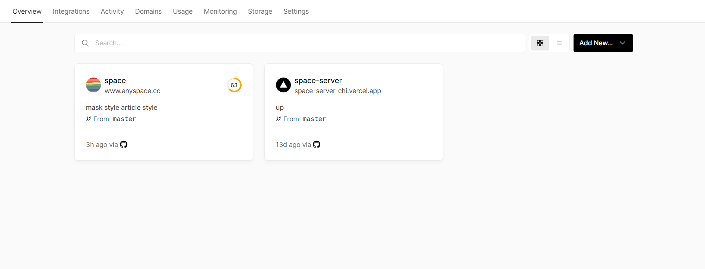
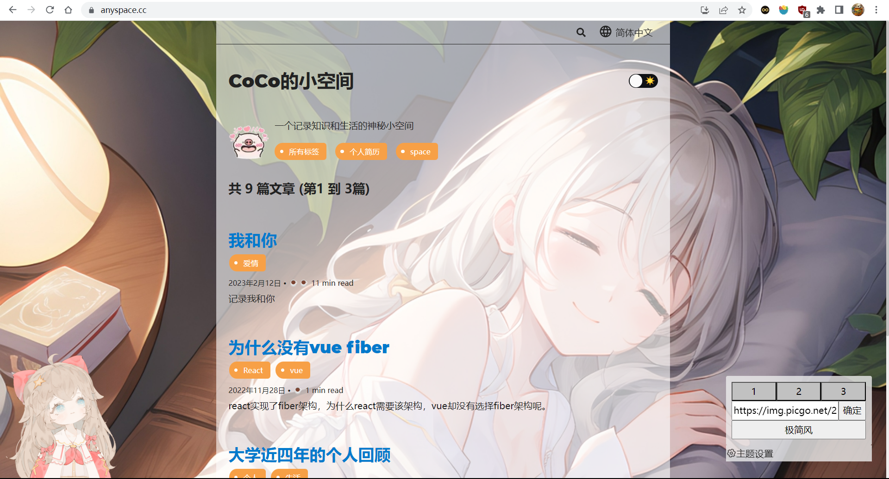

## 写在前面

该网站构建技术栈主要基于react的ssr框架gatsby.js。构建部署在vercel上。用于记录生活和知识的小空间。

## 为什么做这个网站

在大学毕业后，从事了前端开发工作，公司技术栈为react.js，毕业前只学过vue.js框架，大四实习也是使用的vue2x和vue3，为了更好的学习和使用react，我有了在工作外构建一个自己的网站的想法。但是迟迟不知道做一个什么类型的网站，后来在学习react的过程中发现了redux的作者以及react团队核心成员————dan的博客网站，他主要在他的博客网站分享一些react相关的知识，觉得有一个自己的网站中并且记录分享一些知识是一件很好的事，所以便开始了space的构建。

## 开始

最开始考虑了使用什么技术构建，主要考虑了next.js和gatsby.js这两个react的ssr框架。经过了解分析后，我使用了和react官网相同的技术栈即gatsby.js。

网站选择构建部署在了vercel上。最开始尝试构建在国内serverless如腾讯云、阿里云，优点就是国内访问速度快，但是缺点我没法接受😶：因为国内的限制，部署在国内服务器厂商，如果想要自定义域名就需要审核备案，而审核备案又需要自己的服务器，每年服务器的维护花费再加上国内的审核繁琐且容易封停网站我直接选择免费并且稳定的vercel。在这里夸一下vercel：一个神仙团队，他们家的next.js也是非常非常好用的！

## 截至今天（2023.05.26）

space网站已经运行了十个月，代码更新提交了188次了。构建部署了也一百多次了。

网站pc端现状如下

网站手机端现状如下

目前在做主题切换功能，功能已经完成，只是主题切换的ui部分还没有时间和想法去优化。

## 最初

最开始，space网站只有两个简单页面：文章列表页面和文章内容页面，以及夜间模式、多语言功能。后续不断迭代添加了其他功能及页面。

## 添加文章目录

查看文章时，文章很长时阅读体验很不好，所以添加了文章目录功能，可以点击文章目录跳转到相应位置。
其实逻辑很简单：文章的每个小标题是一个锚点，将文章标题遍历创建a标签，更改路由哈希值即可跳转到相应锚点位置。仅有的难点在于样式的处理。当然，我的文章目录是一个简单版的，也可以把他做的更复杂更好用。基于自己的需求去实现即可。

## 文章评论功能、浏览数量功能

本站是静态网站，文章也是使用的md文档存在前端解析成html渲染的。基于需求，我并没有为本站创建后台服务，而是使用了leancloud的云数据库，存放了两张数据表：评论表和文章浏览次数表。具体也可以使用网上的插件实现，也可以使用接口自己封装一个评论组件。其实就是简单的增删改查。不再赘述。

## 网站统计

为了记录下网站的流量，网站被哪些ip、设备等访问，我给网站引入了百度统计，后来不再使用百度统计，使用了vercel的网站统计。具体可以查看相关文档。

## 文章加密

因为也会记录一些个人生活内容，有些涉及隐私，所以增加了每篇文章可以自定义问题密码的功能。

## space

一直想做一个旅行记录app来记录自己的足迹。主要就是记录自己什么时候去过哪里做了什么并且可以查看记录。当然不是简简单单文字记录然后列表查看那么简单。而是将其记录到地图上。

我使用了mapbox来构建了这个页面。本来这个页面是要做成一个独立的app的，但是考虑了域名等问题，就直接融合在了本站。

本来还想要给该功能增加后台管理平台，我使用了nest.js（我个人觉得像是node.js版的spring框架。O(∩_∩)O），但是我将该后台服务部署在vercel serverless上后，发现访问接口国内无法访问，必须需要vpn才可以访问😶。所以暂时就不连接后端api了，后端服务也暂停了开发。暂时先将数据放在vercel云数据库了。

## 主题切换

增加了网站的主题切换功能：可以切换背景（也可输入网络图片地址作为网站背景）、切换极简主题和普通主题。截至今天（2023.05.26）相关功能已经全部实现并上线，ui美化部分还没有完善，后续有时间和想法再完善。

## ...

......